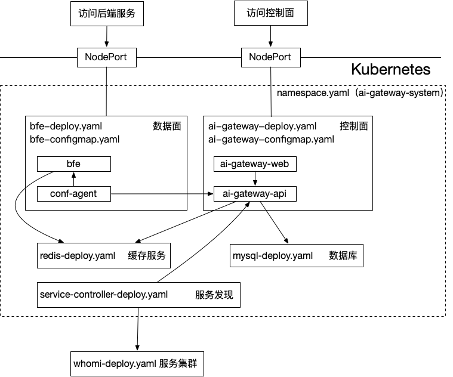

# AI Gateway Kubernetes Deployment Example (BFE + AI Gateway API)

## Overview



This example deploys several key components and demonstrates how they work together in the `ai-gateway-system` namespace:
- Data plane (bfe and conf-agent): traffic forwarding and access control
- Control plane (ai-gateway-api): configuration/policy delivery API
- Base dependencies (MySQL, Redis): storage and dependency services for the control plane
- Service discovery (service-controller): discovers and syncs backend services
- Demo service (whoami): used to validate routing
- Components communicate via Kubernetes Service/DNS, for example:
  - ai-gateway-api.ai-gateway-system.svc.cluster.local
  - mysql.ai-gateway-system.svc.cluster.local
  - redis.ai-gateway-system.svc.cluster.local

Notes:
- MySQL / Redis use `emptyDir` storage in this example and data can be lost after Pod restarts.
- This is primarily for demo/connectivity validation and is not production-ready.

Main files:

| **File** | **Description** |
|---|---|
| `namespace.yaml` | Namespace definition (`ai-gateway-system`) |
| `kustomization.yaml` | Kustomize resource set and image overrides |
| `bfe-configmap.yaml` | bfe configuration (bfe.conf, conf-agent.toml, etc.) |
| `bfe-deploy.yaml` | bfe data plane Deployment |
| `ai-gateway-configmap.yaml` | ai-gateway-api configuration (DB/Redis connection, auth example) |
| `ai-gateway-deploy.yaml` | ai-gateway-api Deployment/Service |
| `mysql-deploy.yaml` | MySQL Deployment (demo DB + storage config) |
| `redis-deploy.yaml` | Redis Deployment/Service (demo cache config) |
| `service-controller-deploy.yaml` | Service discovery controller Deployment |
| `whoami-deploy.yaml` | whoami demo service Deployment |

## Prerequisites

- Version: kubectl must support `-k`
  - Recommended: kubectl >= 1.20 (or any version that can run `kubectl apply -k .`).

- Cluster permissions: kubectl can access the cluster and can create Namespace, Deployment, Service, ConfigMap, Secret, etc.

- Images are pullable: make sure cluster nodes can pull the images.
  - This example manages image names/tags via `images:` in `kustomization.yaml`. Prefer updating that in one place.
  - If you need an image mirror/accelerator, adjust `newName` / `newTag` under `images:`.

- Optional: if your kubectl does not embed kustomize, install kustomize or use a kubectl version with kustomize.

## Deployment

### Configure images

All component images are centralized in `kustomization.yaml` under `images:`.
If you hit image pull failures (e.g. ghcr is not reachable), update `newName`/`newTag` under `images:` instead of editing every `*-deploy.yaml`.

Common mirror example (using `ghcr.nju.edu.cn`):

```yaml
images:
  - name: ghcr.io/bfenetworks/bfe
    newName: ghcr.nju.edu.cn/bfenetworks/bfe
    newTag: v1.8.0-debug

  - name: ghcr.io/yf-networks/ai-gateway-api
    newName: ghcr.nju.edu.cn/yf-networks/ai-gateway-api
    newTag: latest

  - name: ghcr.io/bfenetworks/service-controller
    newName: ghcr.nju.edu.cn/bfenetworks/service-controller
    newTag: latest

  - name: ghcr.io/cc14514/mysql
    newName: ghcr.nju.edu.cn/cc14514/mysql
    newTag: "8"

  - name: ghcr.io/cc14514/redis
    newName: ghcr.nju.edu.cn/cc14514/redis
    newTag: "6.2"
```

> Tip: Prefer changing only `newName` (registry/repo prefix) and `newTag` (version). Keep `name:` consistent with the image names used in the YAML manifests.

> Note: The MySQL image is used both by the MySQL Deployment and by the ai-gateway-api initContainer (which waits for the DB schema to be initialized). Keep them consistent, and ensure the image includes `mysql`/`mysqladmin` clients.

### Deploy BFE stack (data plane, control plane, service discovery)

```bash
cd kubernetes
kubectl apply -k .
```

Notes: `kubectl apply -k .` will deploy the following into the `ai-gateway-system` namespace:
- bfe + conf-agent
- ai-gateway-api
- mysql + init Job
- redis
- service-controller

### Deploy demo service (after BFE stack is running)

```bash
cd kubernetes
kubectl apply -f whoami-deploy.yaml 
```

> The whoami demo is deployed in the `default` namespace (see `whoami-deploy.yaml`) and is not part of `kubectl apply -k .`.
> If whoami also needs to use a mirror, edit the `image:` in `whoami-deploy.yaml` directly.

## Validation

- Check namespace, pods, and services:

```bash
[root@iTM ~]# kubectl get ns ai-gateway-system
NAME         STATUS   AGE
ai-gateway-system   Active   29h

[root@iTM ~]# kubectl -n ai-gateway-system get pods
NAME                                      READY   STATUS    RESTARTS   AGE
ai-gateway-api-xxxxxxxxxx-xxxxx            1/1     Running   0          29h
bfe-85f4d45ddf-4xwdz                      1/1     Running   0          29h
bfe-service-controller-6867d57767-92b5m   1/1     Running   0          29h
mysql-d768d5d4d-fj4j5                     1/1     Running   0          29h
redis-xxxxxxxxxx-xxxxx                     1/1     Running   0          29h

[root@iTM ~]# kubectl -n ai-gateway-system get service
NAME         TYPE        CLUSTER-IP      EXTERNAL-IP   PORT(S)                                        AGE
ai-gateway-api   NodePort    10.105.122.39   <none>        8183:30183/TCP,8284/TCP                        29h
bfe             NodePort    10.108.55.8     <none>        8080:30080/TCP,8443:30443/TCP,8421:30421/TCP   29h
mysql           ClusterIP   None            <none>        3306/TCP                                       29h
redis           ClusterIP   10.96.xx.yy     <none>        6379/TCP                                       29h
[root@iTM ~]#
```

- Login dashboard:
  - Open http://{NodeIP}:30183 in your browser
  - Default username/password: admin/admin

## Cleanup

- Delete demo service

```bash
cd kubernetes
kubectl delete -f whoami-deploy.yaml
```

Recommended deletion order: delete `whoami` first, then delete `ai-gateway-system`.
Reason: `service-controller` may add `finalizers` to whoami-related resources (typically the Service in the `default` namespace). If you delete `ai-gateway-system` first (which removes `service-controller`) and then delete whoami, the finalizer may never be removed and `kubectl delete -f whoami-deploy.yaml` may hang.

- Delete BFE stack (data plane, control plane, service discovery)

```bash
cd kubernetes
kubectl delete -k . 
```

Notes: `kubectl delete -k .` only deletes resources listed under `resources:` in `kustomization.yaml` (mainly components in `ai-gateway-system` + `namespace.yaml`).
whoami is in the `default` namespace and is not part of the `-k` resource set.

If deleting whoami hangs (instead of `-k`), first check whether whoami resources in the `default` namespace have finalizers:

```bash
kubectl get svc whoami -n default -o jsonpath='{.metadata.finalizers}' && echo
kubectl get deploy whoami -n default -o jsonpath='{.metadata.finalizers}' && echo
```

If you confirm it is safe to force cleanup, you can remove whoami finalizers (use with care):

```bash
kubectl patch svc whoami -n default --type=merge -p '{"metadata":{"finalizers":[]}}'
kubectl patch deploy whoami -n default --type=merge -p '{"metadata":{"finalizers":[]}}'
```

If `kubectl delete -k .` hangs (often because the `ai-gateway-system` namespace is stuck in Terminating), it usually means some resources in `ai-gateway-system` still have `finalizers`, while the responsible controller is stopped or cleanup did not complete.

```bash
kubectl describe ns ai-gateway-system
kubectl get ns ai-gateway-system -o jsonpath='{.spec.finalizers}' && echo
```

To locate remaining resources (example):

```bash
kubectl api-resources --verbs=list --namespaced -o name \
  | xargs -n 1 kubectl get -n ai-gateway-system --ignore-not-found --show-kind --no-headers
```

If you confirm it is safe to force cleanup, you can remove namespace finalizers (use with care):

```bash
kubectl patch ns ai-gateway-system --type=merge -p '{"spec":{"finalizers":[]}}'
```

- Delete individual resources (optional):

```bash
# bfe 
kubectl -n ai-gateway-system delete -f service-controller-deploy.yaml
kubectl -n ai-gateway-system delete -f ai-gateway-deploy.yaml
kubectl -n ai-gateway-system delete -f ai-gateway-configmap.yaml
kubectl -n ai-gateway-system delete -f mysql-deploy.yaml
kubectl -n ai-gateway-system delete -f redis-deploy.yaml
kubectl -n ai-gateway-system delete -f bfe-deploy.yaml
kubectl -n ai-gateway-system delete -f bfe-configmap.yaml

# whoami
kubectl delete -f whoami-deploy.yaml
```

## Restart

In this example, MySQL/Redis Pods use `emptyDir`, and data may be lost on restart.
If you want to keep the existing database while updating other Pods (e.g. after changing configs and running `kubectl apply -k .`), you can temporarily comment out or remove `mysql-deploy.yaml` (and optionally `redis-deploy.yaml`) from `kustomization.yaml`, then run `kubectl apply -k .`.

## Key configurations

### Data plane (bfe)

- Image: override via `images:` in `kustomization.yaml`. Use a pinned tag.

- Config mounts: `bfe-configmap.yaml` includes bfe.conf and conf-agent.toml. Make sure the mount paths match the paths referenced in your configs.

- Monitoring port: the example exposes 8421 for health/monitor endpoints. You can verify via Service or `kubectl port-forward`.

- Service ports: the example exposes 8080 (NodePort 30080) for external access.

### Control plane (ai-gateway-api and MySQL/Redis)

- DB connection: configure `Databases.bfe_db.Addr` in `ai_gateway_api.toml` inside `ai-gateway-configmap.yaml` (example: `mysql.ai-gateway-system.svc.cluster.local:3306`).
  - This example mixes plain text and Secret usage for passwords (MySQL root password in Secret + `Passwd` in toml). In production, use Secrets consistently and avoid plain text.

- Auth token: the example token is preconfigured in `bfe-configmap.yaml` (conf-agent.toml) and `service-controller-deploy.yaml`.
  - Use Secrets / short-lived / dynamically managed credentials in production.
  - In production, create tokens in the dashboard: https://github.com/yf-networks/ai-gateway-web/tree/develop

- MySQL storage: `mysql-deploy.yaml` uses an `emptyDir` volume for convenience. Data will be lost after Pod restart, not suitable for production.
  - In production, use PV/PVC with a StorageClass and a backup strategy.

- MySQL initialization: the example uses a Job to run `db_ddl.sql` to initialize schema. ai-gateway-api waits for tables in `open_bfe` via an initContainer before starting.
  - If startup is slow in your environment, increase `startupProbe` tolerances in `mysql-deploy.yaml` (e.g. bump `failureThreshold`).

- See also: [dashboard](https://github.com/yf-networks/ai-gateway-web/tree/develop)

### Service discovery (service-controller and whoami)

- Discovery rules: `service-controller-deploy.yaml` `args` / `env` define discovery strategy, label selectors, and API server address. Adjust to match your service labels/annotations.

- whoami ports: the container listens on port 80, while the Service exposes port 8080 (targetPort=80).

- See also: [service-controller](https://github.com/bfenetworks/service-controller/blob/main/README.md)

